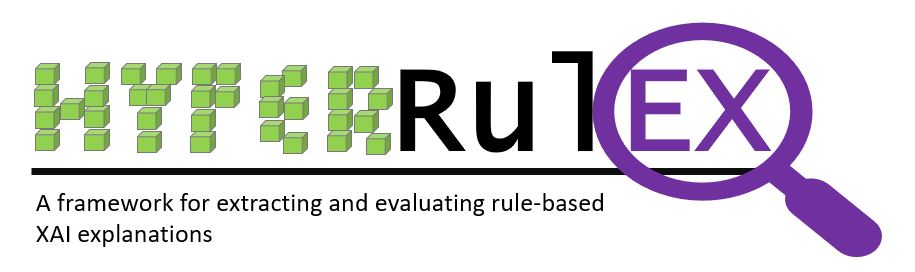
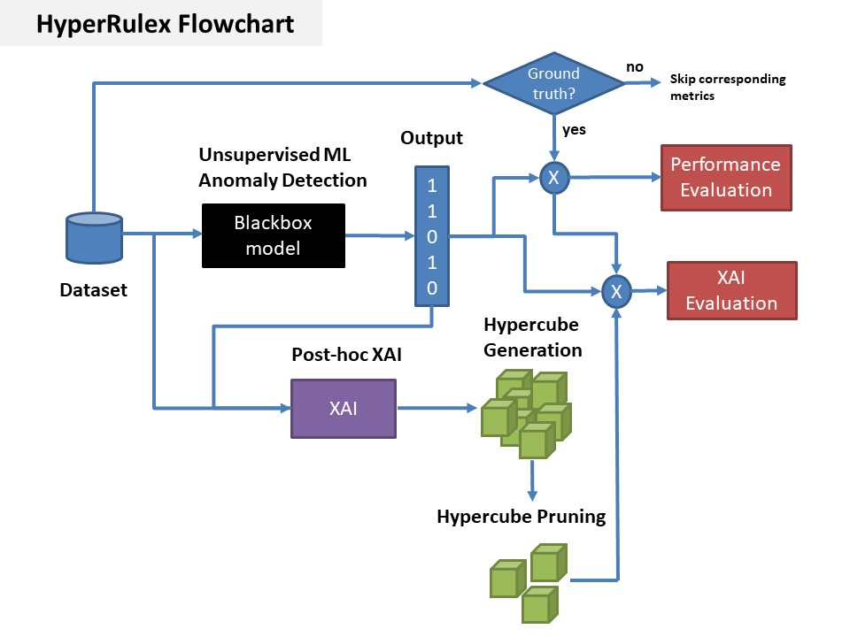

[](https://pypi.python.org/pypi/ansicolortags/) 




# HyperRulEx. A framework for extracting and evaluating rule-based XAI explanations

HyperRuleX is a library that provides a common framework for both extracting and evaluating XAI rule-based methods. We have mainly evaluated it over unsupervised ML algorithms, but the library could be used with other binary classifiers.

The framework uses several rule-based method behind it, and turns the rules exrtracted to hypercubes in order to have a common reference for obtaining XAI metrics that evaluate the quality of the explantions from several points of view.

The XAI metrics included within the library are the following ones (more details about them can be found in the associated scientific paper https://www.sciencedirect.com/science/article/pii/S0957417421014329).

* **Comprehensibility**
* **Fidelity**
* **Representativeness**
* **Focus on Abnormal**
* **Stability**
* **Diversity**


## Getting Started

These instructions will explain how to use the library and be able to obtain the results indicated.

### Prerequisites

The dependencies included in the file requirements.txt are needed to be able to use the library directly or to execute the example (Example.ipynb)

```
$ pip install -r requirements.txt 
```

### Usage
The file **code/tutorial.ipynb** contains a tutorial on how to use the library for both extracting the rule-based explanations and obtaining the XAI metrics associated.

### General Process
The image below describes the process and steps followed by the library.



## More Information

More information regarding the theory behind the algorithms used can be found i the scientific paper associated.

## Authors

* **Alberto Barbado González** - (https://github.com/AlbertoBarbado/)

* Barbado, A., Corcho, Ó., & Benjamins, R. (2022). Rule extraction in unsupervised anomaly detection for model explainability: Application to OneClass SVM. Expert Systems with Applications, 189, 116100.
To cite it (BibTeX):

@article{barbado2022rule,
  title={Rule extraction in unsupervised anomaly detection for model explainability: Application to OneClass SVM},
  author={Barbado, Alberto and Corcho, {\'O}scar and Benjamins, Richard},
  journal={Expert Systems with Applications},
  volume={189},
  pages={116100},
  year={2022},
  publisher={Elsevier}
}

## License

This project is licensed under the Apache License 2.0 - see the [LICENSE.md](LICENSE.md) file for details


